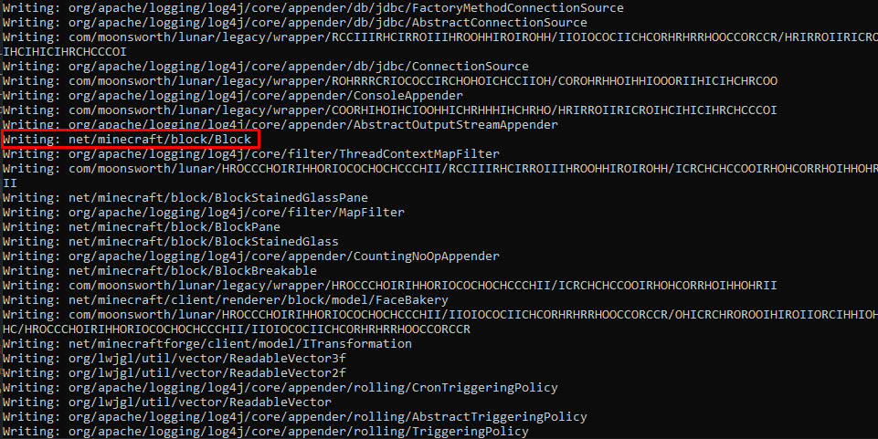
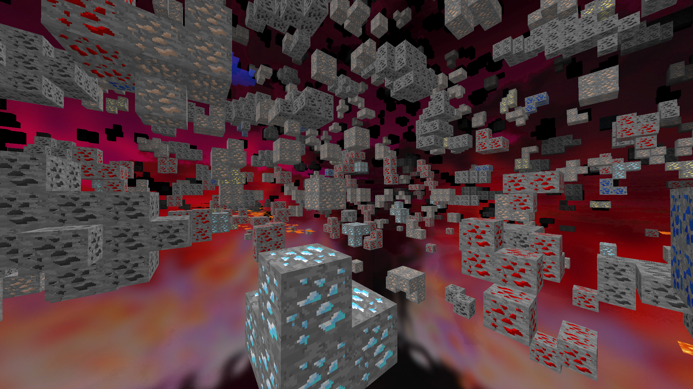

# Goal
Make a basic xray by overwriting JVM classes at runtime.

# Bridge
First we will need to inject our own class to be allowed to communicate between the JVM and the DLL

```java
// JNIBridge.java
public class JNIBridge {
    public static native boolean allowBlock(String blockName);
    public static native boolean xrayOn();
}
```

Make sure to compile it to `.class` with the right JDK version (for me JDK 1.6.0 because I will use Lunar 1.8.9).

* `allowBlock` will ask the DLL if we need to render the block or not.
* `xrayOn` will ask the DLL if xray is on.

# Dump all classes

Then we will look at which class we want to edit. Here, for my xray, I want to edit the `Block` class because this is where the game performs the render logic.

## Find the `net/minecraft/block/Block` class

To get the `Block.class` you can either unzip the JAR file, or if you want, you can also dump all classes with some dynamic class dumper (you can make your own or use [this one](https://www.unknowncheats.me/forum/downloads.php?do=file&id=27701) - you can use Process Hacker to inject the DLL).



If your client is not on Forge it might have some obfuscated methods and class names. If so, you can check:

* [mcp.thiakil.com](https://mcp.thiakil.com)
* [MCPMappingViewer](https://github.com/bspkrs/MCPMappingViewer)

# Edit Block class with Recaf

Then you will need to patch the class file.
I like to use Recaf to do so.

In Recaf, find the method you would like to edit. For me, `shouldSideBeRendered`, because this method returns whether a side should be rendered or not, so for my xray I will be able to control what to render or not.

```diff lang="java" group="xray"
public boolean shouldSideBeRendered(IBlockAccess iBlockAccess, BlockPos blockPos, EnumFacing enumFacing) {
+       if (JNIBridge.xrayOn()) {
+           return JNIBridge.allowBlock(this.toString())
+       };
        CallbackInfoReturnable callbackInfoReturnable = new CallbackInfoReturnable("shouldSideBeRendered", true);
        handler$zgg000$lunar$xrayDontRenderBlockSides(iBlockAccess, blockPos, enumFacing, callbackInfoReturnable);
        if (callbackInfoReturnable.isCancelled()) {
            return callbackInfoReturnable.getReturnValueZ();
        }
        if (enumFacing == EnumFacing.DOWN && this.minY > 0.0d) {
            return true;
        }
        if (enumFacing == EnumFacing.UP && this.maxY < 1.0d) {
            return true;
        }
        if (enumFacing == EnumFacing.NORTH && this.minZ > 0.0d) {
            return true;
        }
        if (enumFacing == EnumFacing.SOUTH && this.maxZ < 1.0d) {
            return true;
        }
        if (enumFacing != EnumFacing.WEST || this.minX <= 0.0d) {
            return (enumFacing == EnumFacing.EAST && this.maxX < 1.0d) || !iBlockAccess.getBlockState(blockPos).getBlock().isOpaqueCube();
        }
        return true;
    }
```

```diff lang="java" group="xray" title="recaf assembler"
.method public shouldSideBeRendered (Lnet/minecraft/world/IBlockAccess;Lnet/minecraft/util/BlockPos;Lnet/minecraft/util/EnumFacing;)Z {
    parameters: { this, ☃, ☃2, ☃3 },
    code: {
+   R:
+       invokestatic JNIBridge.xrayOn ()Z
+       ifeq A
+       aload this
+       invokevirtual java/lang/Object.toString ()Ljava/lang/String;
+       invokestatic JNIBridge.allowBlock (Ljava/lang/String;)Z
+       ireturn 
    A: 
        new org/spongepowered/asm/mixin/injection/callback/CallbackInfoReturnable
        dup 
        ldc "shouldSideBeRendered"
        iconst_1 
        invokespecial org/spongepowered/asm/mixin/injection/callback/CallbackInfoReturnable.<init> (Ljava/lang/String;Z)V
        astore v4
        aload this
        aload ☃
        aload ☃2
        aload ☃3
        aload v4
        invokevirtual net/minecraft/block/Block.handler$zgg000$lunar$xrayDontRenderBlockSides (Lnet/minecraft/world/IBlockAccess;Lnet/minecraft/util/BlockPos;Lnet/minecraft/util/EnumFacing;Lorg/spongepowered/asm/mixin/injection/callback/CallbackInfoReturnable;)V
        aload v4
        invokevirtual org/spongepowered/asm/mixin/injection/callback/CallbackInfoReturnable.isCancelled ()Z
        ifeq B
        aload v4
        invokevirtual org/spongepowered/asm/mixin/injection/callback/CallbackInfoReturnable.getReturnValueZ ()Z
        ireturn 
    B: 
        line 390
        aload ☃3
        getstatic net/minecraft/util/EnumFacing.DOWN Lnet/minecraft/util/EnumFacing;
        if_acmpne D
        aload this
        getfield net/minecraft/block/Block.minY D
        dconst_0 
        dcmpl 
        ifle D
    C: 
        line 391
        iconst_1 
        ireturn 
    D: 
        line 393
        aload ☃3
        getstatic net/minecraft/util/EnumFacing.UP Lnet/minecraft/util/EnumFacing;
        if_acmpne F
        aload this
        getfield net/minecraft/block/Block.maxY D
        dconst_1 
        dcmpg 
        ifge F
    E: 
        line 394
        iconst_1 
        ireturn 
    F: 
        line 396
        aload ☃3
        getstatic net/minecraft/util/EnumFacing.NORTH Lnet/minecraft/util/EnumFacing;
        if_acmpne H
        aload this
        getfield net/minecraft/block/Block.minZ D
        dconst_0 
        dcmpl 
        ifle H
    G: 
        line 397
        iconst_1 
        ireturn 
    H: 
        line 399
        aload ☃3
        getstatic net/minecraft/util/EnumFacing.SOUTH Lnet/minecraft/util/EnumFacing;
        if_acmpne J
        aload this
        getfield net/minecraft/block/Block.maxZ D
        dconst_1 
        dcmpg 
        ifge J
    I: 
        line 400
        iconst_1 
        ireturn 
    J: 
        line 402
        aload ☃3
        getstatic net/minecraft/util/EnumFacing.WEST Lnet/minecraft/util/EnumFacing;
        if_acmpne L
        aload this
        getfield net/minecraft/block/Block.minX D
        dconst_0 
        dcmpl 
        ifle L
    K: 
        line 403
        iconst_1 
        ireturn 
    L: 
        line 405
        aload ☃3
        getstatic net/minecraft/util/EnumFacing.EAST Lnet/minecraft/util/EnumFacing;
        if_acmpne N
        aload this
        getfield net/minecraft/block/Block.maxX D
        dconst_1 
        dcmpg 
        ifge N
    M: 
        line 406
        iconst_1 
        ireturn 
    N: 
        line 408
        aload ☃
        aload ☃2
        invokeinterface net/minecraft/world/IBlockAccess.getBlockState (Lnet/minecraft/util/BlockPos;)Lnet/minecraft/block/state/IBlockState;
        invokeinterface net/minecraft/block/state/IBlockState.getBlock ()Lnet/minecraft/block/Block;
        invokevirtual net/minecraft/block/Block.isOpaqueCube ()Z
        ifne O
        iconst_1 
        goto P
    O: 
        iconst_0 
    P: 
        ireturn 
    Q: 
    }
}
```

You can also make a fullbright effect if xray is on:

```diff lang="java" group="fullbright" title="java"
public float getAmbientOcclusionLightValue() {
+    if (JNIBridge.xrayOn()) {
+        return 1.0f;
+    }
    CallbackInfoReturnable v1 = new CallbackInfoReturnable("getAmbientOcclusionLightValue", true);
    handler$zgg000$lunar$setXrayLightLevel(v1);
    return v1.isCancelled() ? v1.getReturnValueF() : isBlockNormalCube() ? 0.2f : 1.0f;
}
```

```diff lang="java" group="fullbright" title="recaf assembler"
.method public getAmbientOcclusionLightValue ()F {
    parameters: { this },
    code: {
+   Z:
+       invokestatic JNIBridge.xrayOn ()Z
+       ifeq A
+       fconst_1 
+       freturn 
    A: 
        new org/spongepowered/asm/mixin/injection/callback/CallbackInfoReturnable
        dup 
        ldc "getAmbientOcclusionLightValue"
        iconst_1 
        invokespecial org/spongepowered/asm/mixin/injection/callback/CallbackInfoReturnable.<init> (Ljava/lang/String;Z)V
        astore v1
        aload this
        aload v1
        invokevirtual net/minecraft/block/Block.handler$zgg000$lunar$setXrayLightLevel (Lorg/spongepowered/asm/mixin/injection/callback/CallbackInfoReturnable;)V
        aload v1
        invokevirtual org/spongepowered/asm/mixin/injection/callback/CallbackInfoReturnable.isCancelled ()Z
        ifeq B
        aload v1
        invokevirtual org/spongepowered/asm/mixin/injection/callback/CallbackInfoReturnable.getReturnValueF ()F
        freturn 
    B: 
        line 832
        aload this
        invokevirtual net/minecraft/block/Block.isBlockNormalCube ()Z
        ifeq C
        ldc 0.200000003F
        goto D
    C: 
        fconst_1 
    D: 
        freturn 
    E: 
    }
}
```

```diff lang="java" group="fullbright" title="java"
public int getLightValue() {
+   if (JNIBridge.xrayOn()) {
+       return 15;
+   }
    return this.lightValue;
}
```

```diff lang="java" group="fullbright" title="recaf assembler"
.method public getLightValue ()I {
    parameters: { this },
    code: {
+   Z:
+       invokestatic JNIBridge.xrayOn ()Z
+       ifeq A
+       bipush 15
+       ireturn
    A: 
        line 119
        aload this
        getfield net/minecraft/block/Block.lightValue I
        ireturn 
    B: 
    }
}
```

# Implement the DLL native method logic

## Bool Enable / Disable Logic

First, for the enable logic, I will just return a boolean variable `g_xrayEnabled`.
I will switch it on/off with a thread that checks if I press some keys:

```c++
static jboolean JNICALL Native_xrayOn(JNIEnv*, jclass)
{
    return g_xrayEnabled ? JNI_TRUE : JNI_FALSE;
}
```

## AllowBlock 

In this example, I will just check if it's a `_ore` block. If so, `allowBlock` will return `true`, else `false`:

```c++
static jboolean JNICALL Native_allowBlock(JNIEnv* env, jclass, jstring jName)
{
    if (!jName)
        return JNI_FALSE;

    const char* utf = env->GetStringUTFChars(jName, nullptr);
    bool allowed = false;

    if (utf)
    {
        const char* suffix = "_ore}";
        const size_t len = std::strlen(utf);
        const size_t suf_len = std::strlen(suffix);

        if (len >= suf_len && std::strcmp(utf + (len - suf_len), suffix) == 0)
        {
            allowed = true;
        }

        env->ReleaseStringUTFChars(jName, utf);
    }

    return allowed ? JNI_TRUE : JNI_FALSE;
}
```

# Overwriting classes

## Block Class

For the next steps you will first need to set up JNI and JVMTI and find the `Block` class (`tiEnv` here is my JVMTI env):

```c++
jclass blockClass = nullptr;

for (int i = 0; i < classCount; ++i)
{
    char* sig = nullptr;
    if (tiEnv->GetClassSignature(classes[i], &sig, nullptr) == JVMTI_ERROR_NONE && sig)
    {
        if (std::strcmp(sig, "Lnet/minecraft/block/Block;") == 0)
        {
            blockClass = classes[i];
            break;
        }
    }
}
```

Then you will be able to redefine classes with JVMTI like this:

```c++
jvmtiClassDefinition def;
std::memset(&def, 0, sizeof(def));
def.klass = blockClass;
def.class_byte_count = (jint)sizeof(block_class_bytes);
def.class_bytes = block_class_bytes;

err = tiEnv->RedefineClasses(1, &def);
```

`block_class_bytes` here is just a `char block_class_bytes[]` that contains the bytes of our custom `Block` class that we patched before with Recaf.

# Insert our Bridge class

First, to insert a new class we will need to find the classloader.
We can easily obtain it with **GetClassLoader** from JVMTI by using the location of the known `blockClass` (`env` here is my JNI env):

```c++
jobject blockLoader = nullptr;
err = tiEnv->GetClassLoader(blockClass, &blockLoader);

jclass jniBridgeClass = env->DefineClass(
    "JNIBridge",
    blockLoader,
    reinterpret_cast<const jbyte*>(JNIBridge_class),
    (jsize)sizeof(JNIBridge_class)
);
```

Then we will be able to register all our native methods:

```c++
JNINativeMethod methods[] = {
    {
        const_cast<char*>("allowBlock"),
        const_cast<char*>("(Ljava/lang/String;)Z"),
        (void*)&Native_allowBlock
    },
    {
        const_cast<char*>("xrayOn"),
        const_cast<char*>("()Z"),
        (void*)&Native_xrayOn
    }
};

if (env->RegisterNatives(jniBridgeClass, methods, sizeof(methods) / sizeof(methods[0])) != 0)
{
    LOGF("[MainThread] RegisterNatives(JNIBridge) failed");
    break;
}
LOGF("[MainThread] JNIBridge natives registered");
```


# Reload Chunk

To enable or disable certain rendering features (such as xray), the game must refresh the visual state of all loaded blocks.
This requires **triggering a full chunk reload** inside Minecraft’s rendering engine.

However, Minecraft imposes strict constraints:
**chunk reloading may only be executed from the render thread**.
Calling it from any other thread (e.g., a native worker thread) can cause OpenGL context errors or Java exceptions.

To safely perform a reload from native code, the system relies on three key mechanisms:

1. A **global reload request flag**.
2. A **function hook that intercepts execution on the render thread**.
3. A **JNI-based function** that invokes Minecraft’s internal chunk-reload method.


## 1. Reload Request Flag (`g_needReload`)

Any part of the native code that wants the game to refresh its chunks does **not** call Minecraft directly.
Instead, it simply raises a flag:

```c++
static volatile bool g_needReload = false;
```

And when a reload is needed:

```c++
g_needReload = true;
```

This flag indicates:

> "A reload should happen, but only when we are safely on the render thread."

This prevents invalid thread access to rendering systems or JVM structures.


## 2. Render Thread Hook (`glOrtho` Detour)

Minecraft’s rendering pipeline frequently calls an OpenGL function named **`glOrtho`**.
Most importantly:

* It is *always called on the render thread*.
* It is called *every frame*, guaranteeing regular execution points.

The system replaces `glOrtho` with a custom wrapper. This wrapper performs the following:

1. Checks whether a reload was requested (`g_needReload`).
2. If so, resets the flag and initiates a safe reload.
3. Then calls the original `glOrtho` to preserve the normal game behavior.

Example wrapper (simplified):

```c++
void hk_glOrtho(...) {
    if (g_needReload) {
        g_needReload = false;
        ReloadChunks();   // safe to call here
    }

    original_glOrtho(...); // continue normal rendering
}
```

### How the hook is installed

I will uses **MinHook**, a lightweight and widely used Windows API hooking library.

Simplified:

```c++
MH_Initialize();
MH_CreateHook(&glOrtho, &hk_glOrtho, &original_glOrtho);
MH_EnableHook(MH_ALL_HOOKS);
```


## 3. Java-Based Chunk Reload (`ReloadChunks()`)

The actual reloading is achieved by calling Minecraft’s internal method:

```
Minecraft.getMinecraft().renderGlobal.loadRenderers();
```

To do this safely from native code, the system uses JNI.
```c++
ReloadChunks() {
    // Get JVM thread context
    JNIEnv* env = ...;

    // Call Minecraft.getMinecraft()
    minecraftInstance = call_static_method("Minecraft", "getMinecraft");

    // Access minecraft.renderGlobal
    renderGlobal = get_field(minecraftInstance, "renderGlobal");

    // Perform the actual reload
    call_method(renderGlobal, "loadRenderers");
}
```
# Conclusion
And there we have it — with the class patches, the native bridge, the JVM runtime overwrite, and the chunk-reload system, we now have everything needed to build a fully functional xray for Minecraft.  
From here, you can extend the logic, implement reach, ESP, ...



Feel free to dm me on discord : ``jsthop3``


---

### Credit
* [https://www.unknowncheats.me/forum/minecraft/713887-jni-defineclass-redefineclass-runtime.html](https://www.unknowncheats.me/forum/minecraft/713887-jni-defineclass-redefineclass-runtime.html)

### Source Code
The full project is available on GitHub:
* [https://github.com/jsthope/SimpleLunarXray](https://github.com/jsthope/SimpleLunarXray)
